# ARCHITECTURE.md — Malware Analysis Sandbox

Reference document: system design, provider rationale, toolchain split, and decisions table.
For the roadmap see ROADMAP.md (GitHub Issues/Milestones). For security rules see docs/SECURITY_CONSTRAINTS.md.

---

## System diagram

```
┌──────────────────────────────────┐     ┌──────────────────────────────────┐
│  Bare Metal Host (OVH US)        │     │  AWS us-east-1 (optional)        │
│                                  │     │                                  │
│  KVM hypervisor                  │────▶│  S3 (samples + reports)          │
│  Cape Sandbox (CAPEv2)           │     │    Object Lock for evidence      │
│  INetSim (network simulation)    │     │    integrity                     │
│  Detonation VLAN (air-gapped)    │     │                                  │
│  WireGuard VPN (admin only)      │     │                                  │
│  Sample feeder CLI               │     │                                  │
└──────────────────────────────────┘     └──────────────────────────────────┘
```

**Sample flow** — operator-driven via MalwareBazaar CLI tool:
```
Operator → sample-feeder CLI → MalwareBazaar API
                                    ↓ download + review
                              Cape (local API submission)
                                    ↓ analysis complete
                              Cape reports (local)
                                    ↓ optional
                              S3 (evidence archival)
```

**WireGuard** is admin-only: operator laptop → bare metal host for management and
Cape web UI access.

---

## Why AWS + bare metal (not one or the other)

The bare metal host is the **execution plane** — it runs malware and stores analysis
results locally. AWS is optional **evidence archival** — S3 with Object Lock for
tamper-proof sample preservation.

1. **Blast radius containment**: a sandbox escape gives an attacker a stripped-down
   Linux box with no route to cloud services or operator infrastructure.
2. **Disposability**: the bare metal host can be nuked and rebuilt from Ansible alone.
   Secrets are in Ansible Vault, config is in vars — `make configure` rebuilds everything.
3. **Simplicity**: no Lambda, no SQS, no RDS, no API Gateway, no VPC endpoints.
   The operator submits samples directly via the CLI tool on the host.

---

## Provider decisions

**Bare metal: OVHcloud US**
- OVH US locations: Vint Hill VA (us-east), Hillsboro OR (us-west)
- OVH support is slow but not a blocker for a technical operator
- Minimum viable specs for Cape: 4+ physical cores, 32 GB RAM, 500 GB SSD
- Recommended: ADVANCE-1 or equivalent (8c/16t, 32 GB RAM, NVMe)
- Terraform provider block is the only change if switching providers later

**AWS: us-east-1 (optional — evidence archival only)**
- S3 with Object Lock for tamper-proof sample/report preservation
- Separate AWS account if used — do not mix with other personal or work infra
- Most AWS services (Lambda, SQS, RDS, API GW, VPC, Secrets Manager) have been
  removed — see ADR-016

**Jurisdiction: United States only**
- Operator is US-based; malware analysis work requires US jurisdiction for CFAA
  compliance, chain of custody, and law enforcement cooperation if ever needed
- OVHcloud US (Vint Hill VA / Hillsboro OR) satisfies the bare metal requirement
- AWS region must be `us-east-1`, `us-east-2`, or `us-west-2`
- **For open-source users in other jurisdictions**: the architecture is fully portable.
  Swapping to a local AWS region + local bare metal provider is a Terraform provider
  block change only — no other code changes required. This should be documented
  prominently in README so international users can adapt without legal risk.

---

## Host deployment stack

```
Packer  →  builds hardened Ubuntu 24.04 base image
             - konstruktoid/hardened-images as Ansible provisioner foundation
             - KVM deps, Cape repo cloned, Python deps installed
             - NOT hardware-specific — no DSDT values baked in
             - outputs qcow2 / OVH snapshot

Terraform  →  provisions server from Packer snapshot
               - minimal cloud-init: SSH key injection only
               - outputs server IP for Ansible inventory

Ansible  →  configures the host (idempotent, safely re-runnable)
             - roles: hardening, kvm, networking, inetsim, wireguard, cape, sample-feeder
             - secrets from Ansible Vault (vars/secrets.yml)
             - provider-agnostic — only requires SSH access
```

Single entry point: `Makefile` — `make image`, `make infra`, `make configure`

**Why this split:**

| Tool | Responsibility | Why here |
|---|---|---|
| Packer | OS install, packages, repo clones | Slow, one-time work; produces a reusable snapshot |
| Terraform | Cloud resource provisioning | Declarative, stateful, provider-specific |
| Ansible | Runtime configuration, service setup | Idempotent, handles hardware-specific steps, SSH-only |

Hardware-specific steps (DSDT patching via `kvm-qemu.sh`) live in Ansible only and
are never baked into the Packer image. This is intentional — DSDT values are unique
to each physical host and are captured directly from host firmware at configure time.

**Key constraint:** Cape's `kvm-qemu.sh` patches ACPI DSDT tables with host-specific
values to defeat sandbox evasion by malware that inspects ACPI/SMBIOS firmware strings.
These values cannot be pre-determined and cannot be faked in a virtualised environment —
this is the primary reason bare metal is required.

---

## Ansible roles

> **Implementation status:** All roles are complete. See **ROADMAP.md** for the current backlog.

| Role | Purpose |
|---|---|
| `hardening` | Wraps konstruktoid/ansible-role-hardening (CIS-aligned baseline) |
| `kvm` | Install KVM, QEMU, libvirt; configure hugepages |
| `networking` | Detonation bridge (`virbr-det`), iptables air-gap rules |
| `inetsim` | Network simulation for guest VM traffic (DNS, HTTP, HTTPS, SMTP, FTP) |
| `wireguard` | WireGuard server config — admin access only (operator laptop → host) |
| `cape` | Run `kvm-qemu.sh` with DSDT vars, run `cape2.sh`, configure Cape services |
| `sample-feeder` | MalwareBazaar CLI tool for interactive sample ingestion |

---

## Key technical decisions

Summary table. The **ADR** column is the router — each links to the record with the
context, the alternatives considered and the consequences. Rows without one were never
contentious enough to need an ADR. Full log, grouped and with statuses:
[docs/DECISIONS.md](docs/DECISIONS.md).

| Decision | Choice | Reason | ADR |
|---|---|---|---|
| Bare metal provider | OVHcloud US | Only cost-competitive bare metal provider with US locations | [001](docs/DECISIONS.md#adr-001-bare-metal-provider--ovhcloud-us) |
| Hosting jurisdiction | US only | CFAA compliance, chain of custody, operator is US-based | [002](docs/DECISIONS.md#adr-002-all-infrastructure-hosted-in-the-united-states) |
| Config mgmt / image build | Ansible + Packer + Terraform | Each tool does the layer it is good at; see the ADR for the split | [005](docs/DECISIONS.md#adr-005-packeransibleterraform-toolchain-split) |
| Secrets | Ansible Vault | Encrypted `vars/secrets.yml`, no cloud dependency | [016](docs/DECISIONS.md#adr-016-migrate-secrets-to-ansible-vault-remove-aws-data-plane) |
| WireGuard scope | Admin access only | Operator laptop → host management, never the detonation path | [004](docs/DECISIONS.md#adr-004-wireguard-scope-limited-to-admin-access-only) |
| Detonation network | Isolated KVM bridge (`virbr-det`) | No NAT, iptables DROP toward the management interface | [011](docs/DECISIONS.md#adr-011-guest-network-simulation--inetsim-on-host) |
| Network simulation | INetSim on host | Logs C2 callbacks without real outbound traffic | [011](docs/DECISIONS.md#adr-011-guest-network-simulation--inetsim-on-host) |
| Guest hardening | DSDT patching, anti-evasion measures | Malware that detects a VM does not detonate | [012](docs/DECISIONS.md#adr-012-guest-vm-anti-evasion-hardening) |
| Windows guest OS | Windows 11 Enterprise evaluation | Licensing, and what CAPE is tested against | [009](docs/DECISIONS.md#adr-009-windows-guest-os--windows-11-enterprise-evaluation-iso) |
| Cape agent mode | `cape-agent.py` with capemon | Behavioural coverage the plain agent does not give | [010](docs/DECISIONS.md#adr-010-cape-agent-mode--cape-agentpy-with-capemon) |
| Guest snapshots | clean + office profiles | Office samples need a populated guest; others do not | [013](docs/DECISIONS.md#adr-013-guest-snapshot-strategy--clean--office-profiles) |
| Sample ingestion | MalwareBazaar CLI (`sample-feeder`) | Operator-driven, interactive, no API surface to abuse | [015](docs/DECISIONS.md#adr-015-malwarebazaar-sample-feeder-interactive-cli) |
| Investigation agent | Bounded read-only tools, output-only pins | The agent gets a capability, not a shell | [017](docs/DECISIONS.md#adr-017-investigation-agent-architecture) |
| Schema migrations | Alembic | Reproducible schema, no hand-applied SQL | [018](docs/DECISIONS.md#adr-018-adopt-alembic-for-malware_analysis-schema-migrations) |
| Family attribution | Not a capability metric | Measured 0/14 and 0/7; retired rather than tuned against | [019](docs/DECISIONS.md#adr-019-family-attribution-is-not-a-capability-metric-for-the-re-stage) |
| Sample storage | **Not deployed** — S3 Object Lock deferred | Evidence archival is a standalone future option, not part of the running system | [007](docs/DECISIONS.md#adr-007-s3-object-lock-mode--governance-not-compliance) |
| Hypervisor | KVM/QEMU | Cape requires it | — |
| Cape version | CAPEv2 (kevoreilly) | Active fork; Cuckoo is unmaintained | — |
| Host OS | Ubuntu 24.04 LTS | Cape's recommended and tested target | — |
| Base hardening | konstruktoid/hardened-images | Well-maintained, CIS-aligned, Ansible-based | — |

---

## Full pipeline

```mermaid
flowchart TB
    SAMPLE([Sample submitted])

    subgraph "Stage 1 — Triage"
        TRIAGE["YARA, ssdeep, FLOSS, entropy, PE analysis<br/>🔒 containerized, --network=none"]
    end

    subgraph "Stage 2 — Dynamic Analysis"
        CAPE["CAPEv2 sandbox — Windows 11 guest VMs<br/>KVM/QEMU + anti-evasion hardening<br/>Behavioral signatures, memory dumps, network capture"]
        INJECT["2.5a: Injection Buffer Extraction<br/>WriteProcessMemory API traces — trace-derived injection bytes"]
        PAYLOAD["2.5b: Payload Analysis<br/>Decrypted APIs, file paths, URLs, IPs"]
    end

    subgraph "Stage 2.7 — PCAP"
        PCAP["Zeek (protocol) + Suricata (IDS)<br/>JA3 fingerprints, HTTP details, IDS alerts<br/>🔒 containerized, --network=none"]
    end

    subgraph "Stage 3 — Memory Forensics"
        VOL["Volatility 3 — 6 standard plugins + trigger-gated extras, run in parallel<br/>Injection detection, connections, mutex IOCs<br/>🔒 containerized, --network=none, ramdisk"]
    end

    XCORR["Cross-Correlation<br/>Dropped file loaded? Shellcode self-modified?<br/>Command line spoofed?"]

    subgraph "Stage 4 — Static Analysis"
        direction LR
        GHIDRA["Native PE<br/>Ghidra headless"]
        DOTNET[".NET<br/>de4dotEx + ILSpy"]
        GOBIN["Go<br/>GoReSym"]
        PYINST["PyInstaller<br/>pyinstxtractor + pycdc"]
        JAVA["Java JAR<br/>java-deobfuscator + CFR"]
        OFFICE["Office macros<br/>olevba + mraptor"]
        PWSH["PowerShell<br/>PSDecode"]
    end

    subgraph "Stage 4.5 — AI Investigation"
        LLM["Language-aware LLM analysis<br/>Native PE: agentic with 6 Ghidra tools<br/>.NET/Go/Python/Java/VBA/PS: single-shot<br/>Model escalation: Sonnet → Opus<br/>🟣 via LiteLLM proxy (localhost:4000)"]
    end

    subgraph "Stage 4.7 — Evasion Hunter"
        EVASION["Triggers on low-signature samples<br/>Identifies sandbox detection techniques<br/>Recommends hardening measures<br/>🟣 via LiteLLM proxy"]
    end

    subgraph "Stage 5 — Screenshots + Visual"
        SCREENSHOTS["QEMU VNC capture + perceptual dedup<br/>🔒 containerized, --network=none"]
        VISUAL["Multimodal LLM interpretation<br/>Ransom notes, dialogs, evasion signals<br/>🟣 via LiteLLM proxy"]
    end

    IOC["IOC Extraction<br/>STIX 2.1 types, mutex IOCs from Cape API traces"]

    subgraph "Stage 5 — Summaries"
        SUMMARY["Kill Chain Summary — Haiku<br/>Each claim cites corroborating tool sources"]
        PLAIN["Plain English Summary — Haiku<br/>Non-technical explanation"]
    end

    DB[("Database Ingestion<br/>PostgreSQL — IOCs, techniques,<br/>capabilities, network events")]

    PDF["PDF Report<br/>🔒 containerized WeasyPrint"]

    SAMPLE --> TRIAGE
    TRIAGE --> CAPE
    CAPE --> INJECT
    CAPE --> PAYLOAD
    CAPE --> PCAP
    CAPE --> VOL
    VOL --> GHIDRA & DOTNET & GOBIN & PYINST & JAVA & OFFICE & PWSH
    GHIDRA & DOTNET & GOBIN & PYINST & JAVA & OFFICE & PWSH --> LLM
    LLM --> EVASION
    CAPE --> SCREENSHOTS
    SCREENSHOTS --> VISUAL
    CAPE --> XCORR
    VOL --> XCORR
    EVASION --> XCORR
    XCORR --> IOC
    VISUAL --> IOC
    IOC --> SUMMARY
    SUMMARY --> PLAIN
    PLAIN --> DB
    DB --> PDF

    style TRIAGE fill:#1a3a4a,stroke:#6bb5ff
    style CAPE fill:#4a1a1a,stroke:#ff6b6b
    style PCAP fill:#1a3a4a,stroke:#6bb5ff
    style VOL fill:#1a3a4a,stroke:#6bb5ff
    style GHIDRA fill:#1a3a4a,stroke:#6bb5ff
    style LLM fill:#3a2a4a,stroke:#b56bff
    style EVASION fill:#3a2a4a,stroke:#b56bff
    style VISUAL fill:#3a2a4a,stroke:#b56bff
    style PDF fill:#1a3a4a,stroke:#6bb5ff
    style DB fill:#1a4a2a,stroke:#6bff8b

    subgraph Legend
        direction LR
        L1["🔵 Air-gapped container\n--network=none"]
        L2["🔴 Detonation sandbox\nKVM/QEMU, air-gapped VMs"]
        L3["🟣 LLM stage\nvia LiteLLM proxy → Anthropic API"]
        L4["🟢 Database"]
        style L1 fill:#1a3a4a,stroke:#6bb5ff
        style L2 fill:#4a1a1a,stroke:#ff6b6b
        style L3 fill:#3a2a4a,stroke:#b56bff
        style L4 fill:#1a4a2a,stroke:#6bff8b
    end
```



> [!NOTE]
> **Correlation currently runs *after* interpretation, not before it.** The diagram
> reflects the code: cross-correlation is computed once static analysis and the LLM
> stages have completed, and its findings reach severity scoring, IOC extraction and
> the executive summary — but **not** the agentic RE investigation, which sees only
> its decompiler output. The project's "correlation before generation" principle is
> therefore implemented for the summary writer and not yet for the investigator.
> Tracked in [#420](https://github.com/chrisshaiman/lamware/issues/420), which also
> specifies the experiment that would show whether closing the gap actually helps.

> **LLM network path:** the interpret (LLM-broker) container — the one component touching malware-derived LLM I/O — runs with **`--network=none`** (no host network namespace) and reaches the self-hosted LiteLLM proxy solely through a **bind-mounted Unix socket** (a root `socat` bridge fronts LiteLLM's `localhost:4000`). So it cannot route to host services (Postgres/Keycloak/Mongo/CAPE) or the internet — only LiteLLM. LiteLLM is the only process with outbound HTTPS to Anthropic's API; the Anthropic API key is isolated to LiteLLM's environment — analysis containers never see it. **Every** analysis container is `--network=none`.

---

---

## Host infrastructure

```
OVH Bare Metal
+-- Ubuntu 24.04 (hardened -- CIS baseline via konstruktoid)
+-- KVM/QEMU with DSDT-patched firmware (anti-VM evasion)
+-- CAPEv2 dynamic analysis sandbox
+-- Windows 11 guest VMs with anti-evasion measures
+-- INetSim network simulation
+-- WireGuard VPN for admin access (laptop + phone peers)
+-- Podman (rootless containers for pipeline, root container for LiteLLM)
+-- LiteLLM proxy (centralized LLM API routing, key isolation, cost tracking)
+-- PostgreSQL (analysis database)
+-- React frontend + FastAPI backend (behind WireGuard, nginx reverse proxy)
+-- WebSocket real-time pipeline updates (PG LISTEN/NOTIFY)
+-- Mobile-responsive UI with collapsible sidebar
+-- Unified logging with per-task log files
+-- 20 Ansible roles for fully automated deployment
```

> **Deployment target:** OVH bare metal is the supported, deployed architecture. An earlier design used an AWS data plane (API Gateway → S3 → SQS → Lambda); it never worked and was decommissioned by ADR-016, with the code removed in #211. Nothing in this repo deploys to AWS.

<details>
<summary>Cost estimate</summary>

~$44-92/month (OVH bare metal) + ~$0.50-$5.00/day LLM API costs depending on sample volume.

</details>

---

---

## Database schema

<details>
<summary>Normalized PostgreSQL schema for cross-sample intelligence</summary>

- **IOCs** with STIX 2.1 types — query "which samples share this C2 domain?"
- **MITRE ATT&CK** with tactic context — "show me all T1055 across families"
- **Sample relationships** — dropped/injected file lineage tracking
- **Network events** — structured DNS, HTTP, TCP from sandbox
- **MISP-style tags** — flexible taxonomy on samples, analyses, and IOCs
- **Correlation views** — shared infrastructure, technique frequency, sample lineage

</details>

---

---

## Implementation details

Moved out of the README: true, but not what a reader needs in order to decide whether
the project is worth their time.

**Model routing.** The interpret stage starts on Sonnet and escalates to Opus after 5
tool calls on complex samples; executive summaries run on Haiku. All calls route through
the self-hosted LiteLLM proxy, which is the only process holding the Anthropic key and
the only one with outbound HTTPS.

**Real-time pipeline updates.** Stage transitions are published with PostgreSQL
`NOTIFY pipeline_events` and relayed to the dashboard over a WebSocket, so the UI does
not poll. See `pipeline_status.py` and `api/app/routers/ws.py`.

**Mobile access.** The dashboard is responsive with a collapsible sidebar, reachable
from a phone through its own WireGuard peer.

---

## Language routing

The pipeline detects the binary type and routes to the right tool:

| Binary Type | Tool Chain | Output |
|---|---|---|
| Native PE (C/C++) | Ghidra headless | Pseudocode, imports, xrefs |
| .NET (C#) | de4dotEx deobfuscation + ILSpy | Deobfuscated C# source |
| Go | GoReSym | Recovered function names, types, packages, build info |
| Go (garble) | GoReSym partial + Ghidra fallback | Garbled names but structural metadata |
| PyInstaller | pyinstxtractor + pycdc | Python 3.11/3.12 source, multi-file decompilation |
| Java JAR | java-deobfuscator + CFR | Deobfuscated Java source, manifest, class listing |
| Office (VBA macros) | olevba extraction + mraptor | VBA source, auto-exec triggers, IOCs, deobfuscation |
| PowerShell | pwsh + PSDecode | Multi-layer deobfuscation, CAPE encoded command extraction |

Each path has its own LLM prompt optimized for that language's patterns.
