# lamware

> **Drop a sample. Get a correlated investigation.**

[](https://github.com/chrisshaiman/lamware/releases)
[](LICENSE)
[](https://www.python.org/)
[]()
[]()
[]()
[]()

lamware is an end-to-end malware analysis platform combining dynamic execution, memory forensics, static analysis, and evidence-based LLM investigation in a single pipeline.

The thesis: **malware analysis tools are most useful when their observations are correlated, not when they are read as independent reports.** lamware runs CAPEv2, Volatility 3, Ghidra and language-specific analyzers, applies deterministic cross-tool correlation, and only then gives an LLM access to the resulting evidence.

> **Triage, CAPE and Volatility determine maliciousness. The AI explains the evidence; it does not decide whether a sample is malicious.**

---

## Why lamware?

A conventional workflow leaves the hardest part — deciding which observations corroborate each other — to the analyst:

```
     sample                                    sample
        │                                         │
  ┌─────┼─────┐                        ┌──────────┼──────────┐
  ▼     ▼     ▼                        ▼          ▼          ▼
CAPE  Volat. Ghidra                  CAPE     Volatility   Static
  │     │     │                        └──────────┼──────────┘
  ▼     ▼     ▼                                   ▼
report report report                       deterministic
  │     │     │                            cross-correlation
  └─────┼─────┘                                   ▼
        ▼                                   evidence graph
     analyst                                      ▼
                                           LLM investigation
                                                  ▼
                                     grounded analyst narrative

   conventional                              lamware
```

The LLM sits **downstream of the evidence**. It is never asked to decide maliciousness from a blob of text.

---

## What the AI does — and does not do

| The AI does | The AI does not |
|---|---|
| Investigate decompiled code and follow cross-references | Determine whether a sample is malicious |
| Explain observed behavior, connect static to dynamic findings | Modify the maliciousness verdict |
| Identify plausible attack techniques | Write arbitrary files to the analysis host |
| Produce analyst-oriented narratives | Access another analysis by changing an `analysis_id` |
| Propose findings for human confirmation | Receive the Anthropic API key |
| Help navigate large volumes of analysis output | Reach the network from an analysis container |

LLM output is **interpretation of evidence, not evidence itself**. Findings the agent proposes are held as proposals until an analyst confirms them.

These are capability boundaries rather than input filters: `read_payload` takes an index into a resolved list rather than a path, tool arguments reach subprocesses as `argv` rather than a shell string, sandbox scripts arrive on stdin, and `pin_finding` returns a proposal instead of writing. See [ADR-017](docs/DECISIONS.md) for the architecture and [docs/THREAT_MODEL.md](docs/THREAT_MODEL.md) for what remains unmitigated.

---

## Pipeline

```mermaid
flowchart TB
    SAMPLE([Sample submitted])

    subgraph "Stage 1 — Triage"
        TRIAGE["YARA, ssdeep, FLOSS, entropy, PE analysis<br/>🔒 containerized, --network=none"]
    end

    subgraph "Stage 2 — Dynamic Analysis"
        CAPE["CAPEv2 sandbox — Windows 11 guest VMs<br/>KVM/QEMU + anti-evasion hardening<br/>Behavioral signatures, memory dumps, network capture"]
        INJECT["2.5a: Injection Buffer Extraction<br/>WriteProcessMemory API traces — ground truth"]
        PAYLOAD["2.5b: Payload Analysis<br/>Decrypted APIs, file paths, URLs, IPs"]
    end

    subgraph "Stage 2.7 — PCAP"
        PCAP["Zeek (protocol) + Suricata (IDS)<br/>JA3 fingerprints, HTTP details, IDS alerts<br/>🔒 containerized, --network=none"]
    end

    subgraph "Stage 3 — Memory Forensics"
        VOL["Volatility 3 — 6 standard plugins + trigger-gated extras, run in parallel<br/>Injection detection, connections, mutex IOCs<br/>🔒 containerized, --network=none, ramdisk"]
    end

    XCORR["Cross-Correlation<br/>Dropped file loaded? Shellcode self-modified?<br/>Command line spoofed?"]

    subgraph "Stage 4 — Static Analysis"
        direction LR
        GHIDRA["Native PE<br/>Ghidra headless"]
        DOTNET[".NET<br/>de4dotEx + ILSpy"]
        GOBIN["Go<br/>GoReSym"]
        PYINST["PyInstaller<br/>pyinstxtractor + pycdc"]
        JAVA["Java JAR<br/>java-deobfuscator + CFR"]
        OFFICE["Office macros<br/>olevba + mraptor"]
        PWSH["PowerShell<br/>PSDecode"]
    end

    subgraph "Stage 4.5 — AI Investigation"
        LLM["Language-aware LLM analysis<br/>Native PE: agentic with 6 Ghidra tools<br/>.NET/Go/Python/Java/VBA/PS: single-shot<br/>Model escalation: Sonnet → Opus<br/>🟣 via LiteLLM proxy (localhost:4000)"]
    end

    subgraph "Stage 4.7 — Evasion Hunter"
        EVASION["Triggers on low-signature samples<br/>Identifies sandbox detection techniques<br/>Recommends hardening measures<br/>🟣 via LiteLLM proxy"]
    end

    subgraph "Stage 5 — Screenshots + Visual"
        SCREENSHOTS["QEMU VNC capture + perceptual dedup<br/>🔒 containerized, --network=none"]
        VISUAL["Multimodal LLM interpretation<br/>Ransom notes, dialogs, evasion signals<br/>🟣 via LiteLLM proxy"]
    end

    IOC["IOC Extraction<br/>STIX 2.1 types, mutex IOCs from Cape API traces"]

    subgraph "Stage 5 — Summaries"
        SUMMARY["Kill Chain Summary — Haiku<br/>Each claim cites corroborating tool sources"]
        PLAIN["Plain English Summary — Haiku<br/>Non-technical explanation"]
    end

    DB[("Database Ingestion<br/>PostgreSQL — IOCs, techniques,<br/>capabilities, network events")]

    PDF["PDF Report<br/>🔒 containerized WeasyPrint"]

    SAMPLE --> TRIAGE
    TRIAGE --> CAPE
    CAPE --> INJECT
    CAPE --> PAYLOAD
    CAPE --> PCAP
    CAPE --> VOL
    VOL --> GHIDRA & DOTNET & GOBIN & PYINST & JAVA & OFFICE & PWSH
    GHIDRA & DOTNET & GOBIN & PYINST & JAVA & OFFICE & PWSH --> LLM
    LLM --> EVASION
    CAPE --> SCREENSHOTS
    SCREENSHOTS --> VISUAL
    CAPE --> XCORR
    VOL --> XCORR
    EVASION --> XCORR
    XCORR --> IOC
    VISUAL --> IOC
    IOC --> SUMMARY
    SUMMARY --> PLAIN
    PLAIN --> DB
    DB --> PDF

    style TRIAGE fill:#1a3a4a,stroke:#6bb5ff
    style CAPE fill:#4a1a1a,stroke:#ff6b6b
    style PCAP fill:#1a3a4a,stroke:#6bb5ff
    style VOL fill:#1a3a4a,stroke:#6bb5ff
    style GHIDRA fill:#1a3a4a,stroke:#6bb5ff
    style LLM fill:#3a2a4a,stroke:#b56bff
    style EVASION fill:#3a2a4a,stroke:#b56bff
    style VISUAL fill:#3a2a4a,stroke:#b56bff
    style PDF fill:#1a3a4a,stroke:#6bb5ff
    style DB fill:#1a4a2a,stroke:#6bff8b

    subgraph Legend
        direction LR
        L1["🔵 Air-gapped container\n--network=none"]
        L2["🔴 Detonation sandbox\nKVM/QEMU, air-gapped VMs"]
        L3["🟣 LLM stage\nvia LiteLLM proxy → Anthropic API"]
        L4["🟢 Database"]
        style L1 fill:#1a3a4a,stroke:#6bb5ff
        style L2 fill:#4a1a1a,stroke:#ff6b6b
        style L3 fill:#3a2a4a,stroke:#b56bff
        style L4 fill:#1a4a2a,stroke:#6bff8b
    end
```



> [!NOTE]
> **Correlation currently runs *after* interpretation, not before it.** The diagram
> reflects the code: cross-correlation is computed once static analysis and the LLM
> stages have completed, and its findings reach severity scoring, IOC extraction and
> the executive summary — but **not** the agentic RE investigation, which sees only
> its decompiler output. The project's "correlation before generation" principle is
> therefore implemented for the summary writer and not yet for the investigator.
> Tracked in [#420](https://github.com/chrisshaiman/lamware/issues/420), which also
> specifies the experiment that would show whether closing the gap actually helps.

> **LLM network path:** the interpret (LLM-broker) container — the one component touching malware-derived LLM I/O — runs with **`--network=none`** (no host network namespace) and reaches the self-hosted LiteLLM proxy solely through a **bind-mounted Unix socket** (a root `socat` bridge fronts LiteLLM's `localhost:4000`). So it cannot route to host services (Postgres/Keycloak/Mongo/CAPE) or the internet — only LiteLLM. LiteLLM is the only process with outbound HTTPS to Anthropic's API; the Anthropic API key is isolated to LiteLLM's environment — analysis containers never see it. **Every** analysis container is `--network=none`.

---

## Output

Submit a sample and get back:

| Output | Description |
|---|---|
| **Structured IOCs** | STIX 2.1 types, source attribution, context — ready for SIEM and block lists |
| **MITRE ATT&CK map** | Cape behavioral signatures + AI RE, with IOC-to-technique evidence |
| **Cross-tool findings** | Dropped files confirmed loaded, shellcode self-modification, cmdline spoofing |
| **AI RE narrative** | What the malware does and how — traced through decompiled code |
| **Kill chain summary** | Analyst-ready briefing organized by attack phase |
| **Memory forensics** | Suspicious cmdlines, mutex IOCs, DLLs from unusual paths, process anomalies |
| **PDF report** | Source attribution badges showing which stage surfaced each finding |
| **PostgreSQL DB** | Normalized schema for cross-sample correlation and family tracking |
| **Web dashboard** | Browse analyses, IOCs, MITRE techniques, evasion dashboard, real-time pipeline status |
| **Real-time updates** | WebSocket pipeline progress via PG LISTEN/NOTIFY — no polling |
| **Mobile access** | Responsive UI with collapsible sidebar, WireGuard phone peer |

---

## What Makes This Different

### Cross-tool correlation

Findings that no single tool produces alone:

| Correlation | What it detects | Tools |
|---|---|---|
| Dropped file in `dlllist` | Payload was loaded and executed, not just written | Cape + Volatility |
| `WriteProcessMemory` vs `malfind` | Shellcode decrypted itself after injection | Cape + Volatility |
| Cape cmdline vs PEB cmdline | Process overwrote its own command line to hide | Cape + Volatility |
| Cape DNS vs shellcode APIs | DGA domains + networking APIs = confirmed C2 | Cape + Volatility artifacts |
| YARA family + Cape config | Family-specific config extraction guided by signature | Triage + Cape |

### Ground-truth shellcode extraction

Instead of scanning 17,000+ memory regions heuristically, the platform reads Cape's `WriteProcessMemory` traces directly — extracting the exact injected bytes with source process, target process, and injection address.

### Language-aware static analysis

The pipeline detects the binary type and routes to the right tool:

| Binary Type | Tool Chain | Output |
|---|---|---|
| Native PE (C/C++) | Ghidra headless | Pseudocode, imports, xrefs |
| .NET (C#) | de4dotEx deobfuscation + ILSpy | Deobfuscated C# source |
| Go | GoReSym | Recovered function names, types, packages, build info |
| Go (garble) | GoReSym partial + Ghidra fallback | Garbled names but structural metadata |
| PyInstaller | pyinstxtractor + pycdc | Python 3.11/3.12 source, multi-file decompilation |
| Java JAR | java-deobfuscator + CFR | Deobfuscated Java source, manifest, class listing |
| Office (VBA macros) | olevba extraction + mraptor | VBA source, auto-exec triggers, IOCs, deobfuscation |
| PowerShell | pwsh + PSDecode | Multi-layer deobfuscation, CAPE encoded command extraction |

Each path has its own LLM prompt optimized for that language's patterns.

### AI-driven investigation

**On the native PE path**, the interpret stage uses an LLM's tool-use API with 6 Ghidra query tools. The other language paths (.NET, Go, PyInstaller, Java, Office, PowerShell) receive single-shot interpretation over their decompiler output — see the table above for which analyzer produces it. The agent autonomously lists functions, decompiles suspicious ones, traces cross-references, and reads data — producing a structured analysis of capabilities and MITRE ATT&CK mapping, with every concrete claim checked against the evidence it was shown. It follows leads iteratively rather than making a single pass.

The agent does not attribute a malware family, and it does not decide maliciousness. Family labels come from CAPE signatures or MalwareBazaar metadata and are presented as provenance; the verdict comes from triage, CAPE, and Volatility. See [Evaluation](#evaluation) for why, and what the stage *is* measured on.

| Tool | Description |
|---|---|
| `decompile_function` | Decompile a function by name or address |
| `get_xrefs_to` | What calls this function? |
| `get_xrefs_from` | What does this function call? |
| `get_strings_at` | Defined strings near an address |
| `list_functions` | List/search functions with xref counts |
| `get_data_at` | Read raw bytes at an address |

Single-shot is a deliberate choice there, not a gap: GoReSym and ILSpy already recover named functions, types and packages, so there is little for an agent to navigate toward.

Model escalation: starts with Sonnet, escalates to Opus after 5 tool calls for complex samples. Executive summaries use Haiku for cost efficiency. All API calls route through a self-hosted LiteLLM proxy for key isolation and centralized cost tracking.

### Kill chain narrative

The executive summary organizes findings by behavior — injection, persistence, C2, evasion — not by tool. Each claim cites which tools corroborated it:

> *"The malware injected identical 235-byte shellcode stubs into 59 system processes (Cape API traces), resolving `LoadLibraryA`, `CreateRemoteThread`, and `WSAStartup` at runtime (Volatility memory artifacts), confirming both process injection and C2 communication capability."*

---

## Evaluation

The RE stage is measured, and the measurements are less flattering than a feature list would be. They are kept here rather than in the commit log because a capability claim without its evaluation is marketing.

**What the stage is scored on.** Not "did it name the family" but **"is every concrete claim supported by the evidence the model was shown"**. `grounding_check.py` extracts each concrete IOC value the model asserts — domains, IPs, URLs, registry keys, mutexes — and cross-references it against the source text it was given, after defang normalization. A value whose artifacts do not appear in the source is a fabrication flag. The harness reports `grounded_ratio` and a fabrication count per cell.

This exists because it was needed: a local model produced fluent, well-structured analysis containing an invented C2 domain and an invented registry GUID.

| Metric | What it answers |
|---|---|
| `grounded_ratio` | Did the model make this up? |
| fabrication count | Which specific claims are unsupported |
| `tool_call_error_rate` | Was the model driving the tools, or fighting them |
| `tool_layer_broken` | Was this cell measuring the model or the infrastructure |
| `parse_failed` | Finished but unparseable — neither success nor error |
| `family_guess` | **Contamination probe — not a capability metric** |

**Family attribution does not work here, and that is the expected result.** Measured on the deployed pipeline: a 35B local model scores **0/14**, and the frontier-model reference scores **0/7** on the same samples. MalwareBazaar's own labels disagree with the reference on every one of them. The published literature explains why rather than excusing it — the [MOTIF paper](https://arxiv.org/abs/2111.15031) measures AVClass at **46.78%** and AV majority voting at **62.10%** against expert ground truth, so the label itself is under 50% reliable.

The naive conclusion — "packing destroys family ID" — is **too strong and is not the claim here**. Supervised byte-level classifiers reach 91.66% on real packed malware. The distinction is what is being classified and how: byte histograms, entropy, and section characteristics over a *closed* family set is a different task from an LLM reading *decompiled code* over an open set of 454+. A packer stub is generic as source while staying statistically distinctive as bytes.

So `family_guess` stays in the scorecard **inverted**: near-zero is correct, and an unexpectedly *high* score is evidence of memorized published analyses rather than analysis of the binary. Prompts are not tuned against it.

The same structure explains why published threat-report IOCs cannot ground this stage: **0 of 9** icedid samples and **0 of 2** azorult samples contained any literal from their own linked reports. The reports describe runtime behaviour; static analysis sees the packer. Ground truth for recall therefore comes from CAPE detonation, which is independent of the model's evidence — and is treated as a **lower bound**, since one execution means evasion or a dead C2 under-reports.

**Reproducibility.** Each scorecard cell records the seed *requested* and the sampling configuration the inference server *reported applying* — per cell, not per sweep, because a server can be restarted mid-run and a result whose sampling config is known only by recollection is not reproducible.

**A metric that is implemented and deliberately refused.** Cross-run consensus — keeping only claims that independent runs agree on — is fully implemented and **disabled at the CLI**. The method rests entirely on the runs being independent, and no currently available axis supplies that: seeds are inert on the transport the RE stage uses, and a shallower depth produces a literal prefix of a deeper one, so agreement would be guaranteed by construction. The harness refuses the flag rather than print a table reporting 100% agreement for free.

**Known hazard, recorded because it is one refactor away.** The prompt builder injects the MalwareBazaar family verbatim when present. It does not contaminate the benchmark only because the eval passes the Ghidra sub-report while that field sits at report top level; passing the whole report would silently turn the benchmark into an answer key. The production .NET, PowerShell, and Go paths *do* receive that hint — so a family "identified" on those paths was supplied, not derived.

Full reasoning, measurements, and citations: **[ADR-019](docs/DECISIONS.md)**.

---

## Design principles

**1. Correlation before generation.** The LLM investigates evidence the system has already collected and correlated. It is not asked to discover facts deterministic tooling establishes more reliably.

**2. Evidence and interpretation are different objects.** A CAPE observation is evidence. A Volatility observation is evidence. An LLM's explanation of them is interpretation. These must never silently merge — which is why LLM-derived signal is scored separately from deterministic signal and cannot move the verdict band ([ADR-017](docs/DECISIONS.md), GHSA-f5q8-v78c-mr55).

**3. Failure is not "nothing found".** Every stage must distinguish success+empty, success+findings, partial, timeout, error, and not-run. A failed analyzer must never masquerade as a clean result. This is enforced, not aspirational: `correlation_warnings` reports rules that could not run, `PayloadAccessError` separates "could not look" from "nothing there", and Ghidra `analysis_warnings` separates "could not read the sample" from "nothing to say".

**4. LLMs get capabilities, not trust.** Tools are narrow and purpose-built. The agent receives an analysis capability, never a shell.

**5. Security controls must be executable.** A security property that exists only in documentation is not a control. Container isolation flags, air-gap rules and previously-discovered dead controls all carry regression tests.

**6. Bad metrics should be deleted.** A benchmark that rewards memorization or correlated runs instead of the capability under test is a liability. See [ADR-019](docs/DECISIONS.md).

---

## Current status

lamware is an actively developed **research and engineering project** at v0.x. It is not a finished commercial appliance and not a replacement for an experienced reverse engineer.

**Working end to end:** sandbox detonation, memory forensics, static analysis across 8 binary types, cross-tool correlation, IOC extraction, ATT&CK mapping, LLM-assisted investigation, PDF reporting, web dashboard, and the evaluation harness.

**Known open questions**, tracked rather than papered over:

| Question | Status |
|---|---|
| Does the LLM layer measurably help an analyst? | Unproven — [#314](https://github.com/chrisshaiman/lamware/issues/314), [#312](https://github.com/chrisshaiman/lamware/issues/312) |
| Agent false-positive rate | Unmeasurable today; dismissed proposals are not recorded ([#312](https://github.com/chrisshaiman/lamware/issues/312)) |
| Recall against ground truth | Lower bound only — one detonation per sample ([#314](https://github.com/chrisshaiman/lamware/issues/314)) |
| Production maturity | Single maintainer, large operational surface. Not for unattended use |

See [ROADMAP.md](ROADMAP.md), [CHANGELOG.md](CHANGELOG.md) and [docs/DECISIONS.md](docs/DECISIONS.md).

---

## Security model

lamware executes hostile code, so containment is part of the product rather than an operational footnote.

Every analysis container runs `--network=none --read-only --cap-drop=ALL --security-opt=no-new-privileges` under rootless Podman with dedicated service identities. Detonation happens in isolated KVM/QEMU Windows guests on an air-gapped network with INetSim providing simulated services. The Anthropic API key exists only in LiteLLM's environment; analysis containers never receive it.

Prompt injection is treated as a real attack surface — malware-derived text is wrapped in untrusted-data delimiters with escaping and argument validation — but **containment is the primary boundary**. Prompt-injection defense is defense in depth, not a claim that an LLM can safely process adversarial instructions.

> [!CAUTION]
> **Do not detonate malware until you have independently verified your deployment's containment.** A hypervisor escape or a misconfigured detonation route turns the analysis host into a live-malware host.

**Full detail:** [docs/SECURITY_MODEL.md](docs/SECURITY_MODEL.md) · [docs/THREAT_MODEL.md](docs/THREAT_MODEL.md) · [docs/SECURITY_CONSTRAINTS.md](docs/SECURITY_CONSTRAINTS.md)

---


## Tested Malware Families

| Family | Type | Coverage |
|--------|------|----------|
| Emotet | VB6 packer/loader | Full pipeline, 130+ IOCs, cross-correlation findings |
| CobaltStrike/DidYouRansome | Native C beacon + ransomware | Full pipeline, 174 IOCs, 43 MITRE techniques |
| NanoCore | .NET RAT | ILSpy decompiled, 15 capabilities recovered (family supplied to the prompt as provenance — not an attribution result) |
| AsyncRAT | .NET RAT | de4dotEx deobfuscation + ILSpy, 23 classes extracted |
| BianLian | Go ransomware | GoReSym: 138 functions, 98 packages, SOCKS5 proxy architecture |
| Sliver | Go C2 (garble-obfuscated) | GoReSym partial + evasion hunter: 7 anti-sandbox techniques |
| ExelaStealer | PyInstaller stealer | pycdc: 100K chars Python, Discord/browser credential stealer |
| jRAT/Jacksbot | Java RAT | java-deobfuscator + CFR: 2.1M chars Java, 70 classes |
| LodaRAT | Office macro dropper | olevba: VBA deobfuscation, mshta download cradle recovered |
| SnappyClient | PowerShell stager | PSDecode: CobaltStrike-like shellcode stager, ntdll unhooking |

---

## Quick Start

### Prerequisites

- Terraform >= 1.6, Packer >= 1.10, Ansible >= 2.14
  (plus `pip install -r ansible/requirements-python.txt` into the same environment
  as ansible — the `ipaddr` filter needs `netaddr`)
- OVHcloud API credentials
- WireGuard keypair
- Anthropic API key
- WSL2 if on Windows

### Deploy

```bash
# 1. Provision bare metal
cd ovh && terraform init && terraform apply

# 2. Build Windows guest images locally
cd packer && make image

# 3. Upload guest images
scp output-guest/windows11-guest.qcow2 sandbox:/home/ubuntu/
scp output/windows11-office.qcow2 sandbox:/home/ubuntu/

# 4. Configure everything
cd ansible
ansible-galaxy install -r requirements.yml
pip install -r requirements-python.txt
ansible-vault create vars/secrets.yml   # cape_api_key, anthropic_api_key, etc.
ansible-playbook -i inventory/hosts site.yml --ask-vault-pass

# 5. Submit a sample
ssh sandbox 'sudo machinectl shell pipeline@ /bin/bash -c "sample-feeder --family AsyncRAT --limit 1 --yes"'

# 6. View results
# Dashboard: https://10.200.0.1  (via WireGuard)
# Cape UI:   http://10.200.0.1:8000  (via WireGuard)
# API docs:  https://10.200.0.1/docs  (Swagger UI)
# Reports:   /opt/pipeline/reports/<task_id>/report.pdf
```

---

## Infrastructure

```
OVH Bare Metal
+-- Ubuntu 24.04 (hardened -- CIS baseline via konstruktoid)
+-- KVM/QEMU with DSDT-patched firmware (anti-VM evasion)
+-- CAPEv2 dynamic analysis sandbox
+-- Windows 11 guest VMs with anti-evasion measures
+-- INetSim network simulation
+-- WireGuard VPN for admin access (laptop + phone peers)
+-- Podman (rootless containers for pipeline, root container for LiteLLM)
+-- LiteLLM proxy (centralized LLM API routing, key isolation, cost tracking)
+-- PostgreSQL (analysis database)
+-- React frontend + FastAPI backend (behind WireGuard, nginx reverse proxy)
+-- WebSocket real-time pipeline updates (PG LISTEN/NOTIFY)
+-- Mobile-responsive UI with collapsible sidebar
+-- Unified logging with per-task log files
+-- 20 Ansible roles for fully automated deployment
```

> **Deployment target:** OVH bare metal is the supported, deployed architecture. An earlier design used an AWS data plane (API Gateway → S3 → SQS → Lambda); it never worked and was decommissioned by ADR-016, with the code removed in #211. Nothing in this repo deploys to AWS.

<details>
<summary>Cost estimate</summary>

~$44-92/month (OVH bare metal) + ~$0.50-$5.00/day LLM API costs depending on sample volume.

</details>

---

## Database Schema

<details>
<summary>Normalized PostgreSQL schema for cross-sample intelligence</summary>

- **IOCs** with STIX 2.1 types — query "which samples share this C2 domain?"
- **MITRE ATT&CK** with tactic context — "show me all T1055 across families"
- **Sample relationships** — dropped/injected file lineage tracking
- **Network events** — structured DNS, HTTP, TCP from sandbox
- **MISP-style tags** — flexible taxonomy on samples, analyses, and IOCs
- **Correlation views** — shared infrastructure, technique frequency, sample lineage

</details>

---

## Project structure

```
lamware/
├── api/         FastAPI backend + investigation agent (app/investigate/)
├── frontend/    React dashboard
├── pipeline/    Correlation rules + shared pipeline package
├── shared/      Cross-package utilities (payload discovery, tool validators)
├── tests/       Host, infrastructure and security regression tests
├── ansible/     Host/service configuration — also holds the analysis stages
│                (roles/pipeline/files/stages/) and the eval harness
│                (roles/pipeline/files/lamware_eval/)
├── packer/      Windows guest image builds
├── ovh/         Bare-metal infrastructure (Terraform)
├── scripts/     Operational tooling
└── docs/        Architecture, threat model, ADRs, deployment
```

Tests live beside what they cover: `tests/` (host + security), `api/tests/`, `pipeline/tests/`, `shared/tests/`.

---

## Why this project exists

The interesting question is not *"can an LLM read malware?"* — it obviously can.

The interesting question is: **can an LLM become more useful when given independently collected, correlated evidence and constrained investigation capabilities?**

lamware is an attempt to answer that without giving the model authority over the system it is investigating. That means being willing to find that a capability does not work, delete a misleading metric, fix a security assumption, and publish the result — rather than tuning the story until the benchmark looks good.

If that sounds more interesting than another "AI malware scanner", you are in the right place.

---


## Documentation

| Doc | Description |
|---|---|
| [ARCHITECTURE.md](ARCHITECTURE.md) | System design, provider rationale, deployment topology |
| [docs/DECISIONS.md](docs/DECISIONS.md) | **Architecture decision records** — why things are the way they are, including retired capabilities |
| [docs/SECURITY_MODEL.md](docs/SECURITY_MODEL.md) | Containment, isolation and key-handling detail |
| [docs/THREAT_MODEL.md](docs/THREAT_MODEL.md) | Trust boundaries, adversary model, and residual risk |
| [docs/SECURITY_CONSTRAINTS.md](docs/SECURITY_CONSTRAINTS.md) | Non-negotiable security rules with rationale |
| [ROADMAP.md](ROADMAP.md) | Roadmap — themes + pointers to GitHub Issues/Milestones |
| [docs/archive/STATUS.md](docs/archive/STATUS.md) | Historical build journal (through v0.1.0) |
| [docs/COST_ESTIMATE.md](docs/COST_ESTIMATE.md) | Monthly cost breakdown |

---

## Disclaimer

> [!CAUTION]
> **This platform detonates live malware.** By deploying and using this software, you acknowledge and accept the following:
>
> - **Authorized use only.** This tool is intended for security research, malware analysis, incident response, and educational purposes by authorized professionals. You are solely responsible for ensuring your use complies with all applicable laws, regulations, and organizational policies in your jurisdiction.
> - **Inherent risk.** Executing malware — even in a sandboxed environment — carries inherent risks including but not limited to: unintended network exposure, data loss, system compromise, and lateral movement if containment fails. No sandbox provides absolute isolation.
> - **No warranty.** This software is provided "as is" without warranty of any kind. The author makes no guarantees regarding the completeness, accuracy, or reliability of analysis results. Do not rely solely on automated analysis for security decisions.
> - **Network isolation is your responsibility.** The detonation network must be properly air-gapped before executing samples. Verify iptables rules, bridge isolation, and WireGuard configuration before first use. See [docs/SECURITY_CONSTRAINTS.md](docs/SECURITY_CONSTRAINTS.md).
> - **AI-generated analysis is informational only.** LLM-produced findings (family identification, capability assessment, MITRE mapping) are analytical aids, not definitive verdicts. Human analyst review is required for actionable intelligence.
> - **Sample handling.** You are responsible for the legal and safe acquisition, storage, and disposal of malware samples. Ensure your sample sources (MalwareBazaar, VirusTotal, etc.) are used in accordance with their terms of service.
> - **Not for production security.** This platform is a research tool. It is not a substitute for enterprise security products, EDR solutions, or professional incident response services.

## Author

Christopher Shaiman

## License

Apache 2.0 — see [LICENSE](LICENSE). Third-party component licenses: [THIRD_PARTY_LICENSES.md](THIRD_PARTY_LICENSES.md).
