# lamware

> **Drop a sample. Get a kill chain.**

[](LICENSE)
[](https://www.python.org/)
[]()
[]()
[]()
[]()

An end-to-end malware analysis platform that **connects tools instead of running them independently**. Dynamic sandbox detonation, memory forensics, static analysis, and AI-powered reverse engineering work together — cross-referencing findings to produce intelligence no single tool generates alone.

Most setups run Cape, Volatility, and Ghidra and leave an analyst to correlate three separate reports. lamware automates that correlation step and wraps it in an agentic LLM that investigates the binary like a human analyst would.

---

## Pipeline

```
Sample
  |
  +- Stage 1: Triage -------------- YARA, ssdeep, FLOSS, entropy, PE analysis
  |  (containerized, --network=none)
  |
  +- Stage 2: Dynamic Analysis ---- CAPEv2 sandbox, Windows 11 guest VMs
  |  (KVM/QEMU + anti-evasion)      Behavioral signatures, memory dumps, network capture
  |     |
  |     +- Stage 2.5a: Injection    Extract shellcode bytes directly from WriteProcessMemory
  |     |   Buffer Extraction       API traces -- ground truth, no scanning heuristics
  |     |
  |     +- Stage 2.5b: Payload      Scan unpacked payloads for decrypted APIs,
  |         Analysis                 file paths, URLs, IPs
  |
  +- Stage 2.7: PCAP Analysis ----- Zeek (protocol) + Suricata (IDS)
  |  (containerized, --network=none) JA3 fingerprints, HTTP details, IDS alerts
  |
  +- Stage 3: Memory Forensics ---- Volatility 3 (7 plugins, all parallel)
  |  (containerized, --network=none) Injection detection, connection state, mutex IOCs
  |  Pre-built ISF cache, ramdisk    Process image dumps for .NET payload recovery
  |
  +- Cross-Correlation ------------ Cape + Volatility compared:
  |                                  dropped file loaded? shellcode self-modified?
  |                                  command line spoofed?
  |
  +- Stage 4: Static Analysis ----- Routing by binary type:
  |  (containerized, --network=none)   Native PE: Ghidra headless (functions, pseudocode, xrefs)
  |                                    .NET: de4dotEx deobfuscation + ILSpy (C# source)
  |                                    Go: GoReSym (functions, types, build metadata)
  |                                    PyInstaller: pyinstxtractor + pycdc (Python 3.11/3.12)
  |                                    Java JAR: java-deobfuscator + CFR (Java source)
  |
  +- Stage 4.5: AI Investigation -- Language-aware LLM analysis:
  |  (containerized, --network=host)   Native PE: agentic with 6 Ghidra query tools
  |  Orchestrator validates args       .NET/Go/Python/Java: single-shot source analysis
  |  Model escalation: Sonnet->Opus    Garble-obfuscated Go: Ghidra fallback
  |
  +- Stage 4.7: Evasion Hunter ---- Triggers when CAPE produces < 10 signatures:
  |  (containerized, --network=host)   Identifies sandbox detection techniques
  |                                    Recommends sandbox hardening measures
  |
  +- Stage 5.5: Screenshots ------- QEMU VNC capture (host-side, invisible):
  |  (containerized, --network=none)   Perceptual hash dedup, QR code detection
  |
  +- Stage 5.7: Visual Analysis --- Multimodal LLM screenshot interpretation:
  |  (containerized, --network=host)   Ransom notes, dialogs, evasion signals
  |
  +- IOC Extraction ---------------- Structured indicators from all stages
  |                                    STIX 2.1 types, mutex IOCs from Cape API traces
  |
  +- Kill Chain Summary ------------ LLM narrative organized by attack phase
  |  (Haiku for cost efficiency)       Each claim cites corroborating tool sources
  |
  +- Database Ingestion ------------ PostgreSQL with normalized IOCs, techniques,
  |                                    capabilities, network events, MISP-style tags
  |
  +- PDF Report -------------------- Containerized WeasyPrint (isolated from untrusted data)
```

---

## Output

Submit a sample and get back:

| Output | Description |
|---|---|
| **Structured IOCs** | STIX 2.1 types, source attribution, context — ready for SIEM and block lists |
| **MITRE ATT&CK map** | Cape behavioral signatures + AI RE, with IOC-to-technique evidence |
| **Cross-tool findings** | Dropped files confirmed loaded, shellcode self-modification, cmdline spoofing |
| **AI RE narrative** | What the malware does and how — traced through decompiled code |
| **Kill chain summary** | Analyst-ready briefing organized by attack phase |
| **Memory forensics** | Suspicious cmdlines, mutex IOCs, DLLs from unusual paths, process anomalies |
| **PDF report** | Source attribution badges showing which stage surfaced each finding |
| **PostgreSQL DB** | Normalized schema for cross-sample correlation and family tracking |
| **Web dashboard** | Browse analyses, IOCs, MITRE techniques, and pipeline logs |
| **Pipeline status** | Real-time per-stage progress tracking with log viewer |

---

## What Makes This Different

### Cross-tool correlation

Findings that no single tool produces alone:

| Correlation | What it detects | Tools |
|---|---|---|
| Dropped file in `dlllist` | Payload was loaded and executed, not just written | Cape + Volatility |
| `WriteProcessMemory` vs `malfind` | Shellcode decrypted itself after injection | Cape + Volatility |
| Cape cmdline vs PEB cmdline | Process overwrote its own command line to hide | Cape + Volatility |
| Cape DNS vs shellcode APIs | DGA domains + networking APIs = confirmed C2 | Cape + Volatility artifacts |
| YARA family + Cape config | Family-specific config extraction guided by signature | Triage + Cape |

### Ground-truth shellcode extraction

Instead of scanning 17,000+ memory regions heuristically, the platform reads Cape's `WriteProcessMemory` traces directly — extracting the exact injected bytes with source process, target process, and injection address.

### Language-aware static analysis

The pipeline detects the binary type and routes to the right tool:

| Binary Type | Tool Chain | Output |
|---|---|---|
| Native PE (C/C++) | Ghidra headless | Pseudocode, imports, xrefs |
| .NET (C#) | de4dotEx deobfuscation + ILSpy | Deobfuscated C# source |
| Go | GoReSym | Recovered function names, types, packages, build info |
| Go (garble) | GoReSym partial + Ghidra fallback | Garbled names but structural metadata |
| PyInstaller | pyinstxtractor + pycdc | Python 3.11/3.12 source, multi-file decompilation |
| Java JAR | java-deobfuscator + CFR | Deobfuscated Java source, manifest, class listing |
| Office (VBA macros) | olevba extraction + mraptor | VBA source, auto-exec triggers, IOCs, deobfuscation |
| PowerShell | pwsh + PSDecode | Multi-layer deobfuscation, CAPE encoded command extraction |

Each path has its own LLM prompt optimized for that language's patterns.

### AI-driven investigation

The interpret stage uses an LLM's tool-use API with 6 Ghidra query tools. The agent autonomously lists functions, decompiles suspicious ones, traces cross-references, and reads data — producing a structured analysis with malware family identification and MITRE ATT&CK mapping. It follows leads iteratively rather than making a single pass.

| Tool | Description |
|---|---|
| `decompile_function` | Decompile a function by name or address |
| `get_xrefs_to` | What calls this function? |
| `get_xrefs_from` | What does this function call? |
| `get_strings_at` | Defined strings near an address |
| `list_functions` | List/search functions with xref counts |
| `get_data_at` | Read raw bytes at an address |

Model escalation: starts with Sonnet, escalates to Opus after 5 tool calls for complex samples. Executive summaries use Haiku for cost efficiency.

### Kill chain narrative

The executive summary organizes findings by behavior — injection, persistence, C2, evasion — not by tool. Each claim cites which tools corroborated it:

> *"The malware injected identical 235-byte shellcode stubs into 59 system processes (Cape API traces), resolving `LoadLibraryA`, `CreateRemoteThread`, and `WSAStartup` at runtime (Volatility memory artifacts), confirming both process injection and C2 communication capability."*

---

## Quick Start

### Prerequisites

- Terraform >= 1.6, Packer >= 1.10, Ansible >= 2.14
- OVHcloud API credentials
- WireGuard keypair
- Anthropic API key
- WSL2 if on Windows

### Deploy

```bash
# 1. Provision bare metal
cd ovh && terraform init && terraform apply

# 2. Build Windows guest images locally
cd packer && make image

# 3. Upload guest images
scp output-guest/windows11-guest.qcow2 sandbox:/home/ubuntu/
scp output/windows11-office.qcow2 sandbox:/home/ubuntu/

# 4. Configure everything
cd ansible
ansible-galaxy install -r requirements.yml
ansible-vault create vars/secrets.yml   # cape_api_key, anthropic_api_key, etc.
ansible-playbook -i inventory/hosts site.yml --ask-vault-pass

# 5. Submit a sample
ssh sandbox 'sudo -u cape sample-feeder --family AsyncRAT --limit 1 --yes'

# 6. View results
# Dashboard: https://10.200.0.1  (via WireGuard)
# Cape UI:   http://10.200.0.1:8000  (via WireGuard)
# API docs:  https://10.200.0.1/docs  (Swagger UI)
# Reports:   /opt/pipeline/reports/<task_id>/report.pdf
```

---

## Security Model

Every analysis tool runs in a Podman container with:

- `--network=none` — no network access (AI container excluded; needs LLM API)
- `--read-only` — immutable filesystem
- `--cap-drop=ALL` — no Linux capabilities
- `--user 65534:65534` — unprivileged nobody user

> [!WARNING]
> **The detonation network is fully air-gapped.** `virbr-det` has no route to `eth0` or `wg0`. iptables DROP rules are enforced before any ACCEPT. INetSim simulates internet services for guest VMs. All admin access is through WireGuard VPN.

**LLM prompt injection mitigations:**

- All binary data wrapped in `UNTRUSTED_DATA` / `UNTRUSTED_CODE` delimiters
- LLM output is informational only — never modifies verdicts or triggers actions
- Tool argument validation via regex whitelist before reaching Ghidra
- Post-processing detection for prompt influence keywords
- Full audit logging of prompts and responses
- Triage/Cape/Volatility determine maliciousness — AI explains *how*, not *whether*

**Frontend security:**

- `rehype-sanitize` on all markdown rendering (LLM narratives contain malware-derived content)
- CORS restricted to explicit methods and headers (no wildcards)
- API key authentication on all REST and WebSocket endpoints
- `npm audit` in CI for frontend dependency vulnerabilities

**Development security (CI gates on every PR):**

| Tool | What it checks |
|------|---------------|
| [gitleaks](https://github.com/gitleaks/gitleaks) | Secret scanning — pre-commit hook + CI gate, full history audited |
| [bandit](https://github.com/PyCQA/bandit) | Python SAST — security anti-patterns in src/ and api/ |
| [semgrep](https://github.com/semgrep/semgrep) | Python pattern-based SAST — 151 rules (injection, SSRF, deserialization) |
| [pip-audit](https://github.com/pypa/pip-audit) | Python SCA — dependency vulnerabilities against OSV/PyPI advisory DB |
| [npm audit](https://docs.npmjs.com/cli/commands/npm-audit) | JavaScript SCA — frontend dependency vulnerabilities |
| [ruff](https://github.com/astral-sh/ruff) | Python linting — pre-commit hook + CI |
| [ansible-lint](https://github.com/ansible/ansible-lint) | Ansible quality and security rules |
| `terraform validate` | IaC syntax and schema validation |

All Python dependencies pinned to exact versions (`==`) for deterministic SCA scanning.

**Service user separation:**

Three dedicated system users with least-privilege access. A compromise of any one service limits blast radius to that user's permissions.

```mermaid
graph TB
    subgraph "cape user"
        CAPE_CORE["CAPE core<br/>cape, cape-web, cape-processor"]
        CAPE_ROOTER["CAPE rooter (root)<br/>tcpdump, iptables"]
        CAPE_STORAGE["/opt/CAPEv2/storage/<br/>Owner: cape (read + write)<br/>Group: lamware (read only)"]
    end

    subgraph "pipeline user"
        PIPELINE["Pipeline orchestrator<br/>run-pipeline.py"]
        AUTOFEEDER["Auto-feeder<br/>auto-feeder.py"]
        CONTAINERS["13 Podman containers<br/>triage, ghidra, volatility, etc."]
        REPORTS["/opt/pipeline/reports/<br/>Owner: pipeline (read + write)<br/>Group: lamware (read only)"]
        TOOLS["/opt/triage/, /opt/ghidra/, etc.<br/>Owner: pipeline (read + write)<br/>Group: lamware (read only)"]
    end

    subgraph "lamware-api user"
        API["FastAPI backend<br/>uvicorn (systemd hardened)"]
        SPOOL["/opt/pipeline/spool/<br/>Owner: lamware-api (read + write)<br/>Group: lamware (read + write)"]
        CONTROL["/opt/pipeline/control/<br/>Owner: lamware-api (read + write)<br/>Group: lamware (read + write)"]
    end

    subgraph "Shared access (lamware group)"
        direction LR
        LAMWARE_GROUP["lamware group<br/>members: cape, pipeline, lamware-api<br/>Grants read-only access to other users' directories"]
    end

    CAPE_CORE -->|writes| CAPE_STORAGE
    PIPELINE -->|reads via group| CAPE_STORAGE
    PIPELINE -->|runs| CONTAINERS
    PIPELINE -->|writes| REPORTS
    API -->|reads via group| REPORTS
    API -->|writes uploads| SPOOL
    SPOOL -->|systemd path unit<br/>triggers pipeline| PIPELINE
    AUTOFEEDER -->|invokes| PIPELINE

    style CAPE_CORE fill:#4a1a1a,stroke:#ff6b6b
    style PIPELINE fill:#1a3a4a,stroke:#6bb5ff
    style API fill:#1a4a2a,stroke:#6bff8b
    style LAMWARE_GROUP fill:#3a3a1a,stroke:#ffdb6b
```



**How the access model works:**

Each directory has an **owner** (full control) and a **group** (limited access). All three users are members of the `lamware` group, which provides the cross-service read access needed for the pipeline to flow.

| Directory | Owner (full control) | Group access (lamware) | Others |
|-----------|---------------------|----------------------|--------|
| `/opt/CAPEv2/storage/` | `cape` — read, write, create analysis results | `pipeline` — read analysis output for processing | No access |
| `/opt/pipeline/reports/` | `pipeline` — read, write, create reports | `lamware-api` — read to serve PDFs and logs | No access |
| `/opt/triage/`, `/opt/ghidra/`, etc. | `pipeline` — read, write, run containers | Other lamware members — read only | No access |
| `/opt/pipeline/spool/` | `lamware-api` — write uploaded samples | `pipeline` — read + delete after processing (delete requires directory write) | No access |
| `/opt/pipeline/control/` | `lamware-api` — create + delete PAUSE file | `pipeline` — read only (checks if PAUSE exists) | No access |
| `/opt/lamware-api/` | `lamware-api` — API code and venv | No group access needed | No access |

**What each user can and cannot do:**

| | cape | pipeline | lamware-api |
|---|---|---|---|
| Read CAPE analysis results | Yes (owner) | Yes (group) | No |
| Write CAPE analysis results | Yes (owner) | No | No |
| Read pipeline reports | No | Yes (owner) | Yes (group) |
| Write pipeline reports | No | Yes (owner) | No |
| Run Podman containers | Yes | Yes | No |
| Manage VMs (libvirt/KVM) | Yes | No | No |
| Access database | Yes | Yes | Yes (read-focused) |
| Submit samples to CAPE API | No | Yes | No |
| Serve web traffic | No | No | Yes |

| User | Runs as | Systemd hardening | Process monitoring |
|------|---------|-------------------|--------------------|
| `cape` | CAPE core services | Drop-in: `Group=lamware`, `UMask=0027` | Full command allowlist, high priority alerts |
| `pipeline` | Pipeline, auto-feeder, containers | `NoNewPrivileges`, `ProtectKernelModules` | Full command allowlist, high priority alerts |
| `lamware-api` | FastAPI only | `ProtectSystem=strict`, `ProtectHome`, `PrivateTmp`, `NoNewPrivileges` | Only `uvicorn` allowed, **critical** priority alerts |

**Runtime process monitoring:**

The network monitor runs every 5 minutes and checks each user's running processes against a full command-line allowlist. Unexpected processes trigger ntfy push notifications — critical priority for `lamware-api` (should only ever run uvicorn), high priority for `cape` and `pipeline`.

---

## Infrastructure

```
OVH Bare Metal
+-- Ubuntu 24.04 (hardened -- CIS baseline via konstruktoid)
+-- KVM/QEMU with DSDT-patched firmware (anti-VM evasion)
+-- CAPEv2 dynamic analysis sandbox
+-- Windows 11 guest VMs with anti-evasion measures
+-- INetSim network simulation
+-- WireGuard VPN for admin access
+-- Podman (rootless containers for all tool stages)
+-- PostgreSQL (analysis database)
+-- React frontend + FastAPI backend (behind WireGuard)
+-- Unified logging with per-task log files
+-- 19 Ansible roles for fully automated deployment
```

<details>
<summary>Cost estimate</summary>

~$44-92/month (OVH bare metal) + ~$0.50-$5.00/day LLM API costs depending on sample volume.

</details>

---

## Database Schema

<details>
<summary>Normalized PostgreSQL schema for cross-sample intelligence</summary>

- **IOCs** with STIX 2.1 types — query "which samples share this C2 domain?"
- **MITRE ATT&CK** with tactic context — "show me all T1055 across families"
- **Sample relationships** — dropped/injected file lineage tracking
- **Network events** — structured DNS, HTTP, TCP from sandbox
- **MISP-style tags** — flexible taxonomy on samples, analyses, and IOCs
- **Correlation views** — shared infrastructure, technique frequency, sample lineage

</details>

---

## Tested Malware Families

| Family | Type | Coverage |
|--------|------|----------|
| Emotet | VB6 packer/loader | Full pipeline, 130+ IOCs, cross-correlation findings |
| CobaltStrike/DidYouRansome | Native C beacon + ransomware | Full pipeline, 174 IOCs, 43 MITRE techniques |
| NanoCore | .NET RAT | ILSpy decompiled, LLM identified family + 15 capabilities |
| AsyncRAT | .NET RAT | de4dotEx deobfuscation + ILSpy, 23 classes extracted |
| BianLian | Go ransomware | GoReSym: 138 functions, 98 packages, SOCKS5 proxy architecture |
| Sliver | Go C2 (garble-obfuscated) | GoReSym partial + evasion hunter: 7 anti-sandbox techniques |
| ExelaStealer | PyInstaller stealer | pycdc: 100K chars Python, Discord/browser credential stealer |
| jRAT/Jacksbot | Java RAT | java-deobfuscator + CFR: 2.1M chars Java, 70 classes |
| LodaRAT | Office macro dropper | olevba: VBA deobfuscation, mshta download cradle recovered |
| SnappyClient | PowerShell stager | PSDecode: CobaltStrike-like shellcode stager, ntdll unhooking |

---

## Documentation

| Doc | Description |
|---|---|
| [ARCHITECTURE.md](ARCHITECTURE.md) | System design, provider rationale, deployment topology |
| [docs/SECURITY_CONSTRAINTS.md](docs/SECURITY_CONSTRAINTS.md) | Non-negotiable security rules with rationale |
| [docs/STATUS.md](docs/STATUS.md) | Build status and roadmap |
| [docs/DECISIONS.md](docs/DECISIONS.md) | Architecture decision records (ADR log) |
| [docs/COST_ESTIMATE.md](docs/COST_ESTIMATE.md) | Monthly cost breakdown |

---

## Disclaimer

> [!CAUTION]
> **This platform detonates live malware.** By deploying and using this software, you acknowledge and accept the following:
>
> - **Authorized use only.** This tool is intended for security research, malware analysis, incident response, and educational purposes by authorized professionals. You are solely responsible for ensuring your use complies with all applicable laws, regulations, and organizational policies in your jurisdiction.
> - **Inherent risk.** Executing malware — even in a sandboxed environment — carries inherent risks including but not limited to: unintended network exposure, data loss, system compromise, and lateral movement if containment fails. No sandbox provides absolute isolation.
> - **No warranty.** This software is provided "as is" without warranty of any kind. The author makes no guarantees regarding the completeness, accuracy, or reliability of analysis results. Do not rely solely on automated analysis for security decisions.
> - **Network isolation is your responsibility.** The detonation network must be properly air-gapped before executing samples. Verify iptables rules, bridge isolation, and WireGuard configuration before first use. See [docs/SECURITY_CONSTRAINTS.md](docs/SECURITY_CONSTRAINTS.md).
> - **AI-generated analysis is informational only.** LLM-produced findings (family identification, capability assessment, MITRE mapping) are analytical aids, not definitive verdicts. Human analyst review is required for actionable intelligence.
> - **Sample handling.** You are responsible for the legal and safe acquisition, storage, and disposal of malware samples. Ensure your sample sources (MalwareBazaar, VirusTotal, etc.) are used in accordance with their terms of service.
> - **Not for production security.** This platform is a research tool. It is not a substitute for enterprise security products, EDR solutions, or professional incident response services.

## Author

Christopher Shaiman

## License

Apache 2.0 — see [LICENSE](LICENSE). Third-party component licenses: [THIRD_PARTY_LICENSES.md](THIRD_PARTY_LICENSES.md).
