<!-- Moved out of README.md: this is deployment-time detail, and it was 28% of a
document whose job is to tell a first-time reader what lamware is. The README keeps a
summary and links here. -->

# Security Model

For the full trust-boundary analysis, adversary model, and an explicit
residual-risk / "what this does **not** protect against" section, see
[docs/THREAT_MODEL.md](docs/THREAT_MODEL.md). The essentials:

Every analysis tool runs in a **rootless** Podman container with:

- `--network=none` — no network access for **every** analysis container; the interpret (LLM-broker) container reaches LiteLLM only through a bind-mounted Unix socket, never the network
- `--read-only` — immutable filesystem
- `--cap-drop=ALL` — no Linux capabilities
- `--security-opt=no-new-privileges` — no privilege escalation
- Non-root execution — most wrappers pass `--user 65534:65534`; others (e.g. the Python sandbox) pin the user via the image `USER` directive. Because Podman runs **rootless**, even a container that runs as UID 0 maps to an unprivileged host UID — never host root. Containment (network/filesystem/caps), not the in-container UID, is the primary boundary.

> [!WARNING]
> **The detonation network is fully air-gapped.** `virbr-det` has no route to the management interface (`management_interface`, `enp3s0f0` on the current host — **not** literally `eth0`) or `wg0`. iptables DROP rules are enforced before any ACCEPT. INetSim simulates internet services for guest VMs. All admin access is through WireGuard VPN.
>
> **Verify containment before first detonation.** The `security-test` Ansible role (`make security-test`) checks core auth/TLS controls post-deploy. It does **not** check the air gap — that is the `network-monitor` cron job, which asserts the iptables DROP rules exist and are ordered above any ACCEPT, and alarms if the detonation bridge's ACCEPT counters move; run it after any infrastructure change. A misconfigured `virbr-det` route or a hypervisor escape turns this into a live-malware box with network — treat the containment checks as mandatory, not optional.

**LLM API isolation:**

- All Claude API calls route through a self-hosted **LiteLLM proxy** (root Podman container, systemd-managed)
- The Anthropic API key exists only in LiteLLM's environment file (`0600`, root-owned) — never in pipeline templates or container env vars
- Analysis containers authenticate to LiteLLM with an internal master key, supplied from
  the Ansible vault (`litellm_master_key`) — there is no default, so a deploy that omits
  it fails rather than falling back to a shared credential
- LiteLLM's Anthropic passthrough endpoint preserves the native SDK protocol — no code rewrite needed

**LLM prompt injection mitigations:**

- All binary data wrapped in `UNTRUSTED_DATA` / `UNTRUSTED_CODE` delimiters, with delimiter-escape and newline neutralisation on adversary-controlled fields
- LLM output is informational only — never modifies verdicts or triggers actions (`pin_finding` returns *proposed* only; a separate analyst-confirmed step is required to persist anything)
- **Pipeline interpret stage:** regex-whitelist validation of arguments for the six Ghidra tools before they reach the decompiler (tools outside that set fall through to the caller's own checks), plus post-processing detection for prompt-influence keywords
- **Investigation agent:** the primary boundary is containment — Ghidra/sandbox tools run with no network, read-only, all capabilities dropped, and only ever return data to the analyst (no action or verdict side effects). *(Arg-shape validation at the agent's tool-dispatch boundary is a tracked hardening follow-up.)*
- Full audit logging of prompts and responses
- Triage/Cape/Volatility determine maliciousness — AI explains *how*, not *whether*

**Frontend security:**

- `rehype-sanitize` on all markdown rendering (LLM narratives contain malware-derived content)
- CORS restricted to explicit methods and headers (no wildcards)
- API key authentication on all REST and WebSocket endpoints
- `npm audit` in CI for frontend dependency vulnerabilities

**Development security (CI gates on every PR):**

| Tool | What it checks |
|------|---------------|
| [gitleaks](https://github.com/gitleaks/gitleaks) | Secret scanning — pre-commit hook + CI gate, full history audited |
| [bandit](https://github.com/PyCQA/bandit) | Python SAST — security anti-patterns in src/ and api/ |
| [semgrep](https://github.com/semgrep/semgrep) | Python pattern-based SAST — 151 rules (injection, SSRF, deserialization) |
| [pip-audit](https://github.com/pypa/pip-audit) | Python SCA — dependency vulnerabilities against OSV/PyPI advisory DB |
| [npm audit](https://docs.npmjs.com/cli/commands/npm-audit) | JavaScript SCA — frontend dependency vulnerabilities |
| [ruff](https://github.com/astral-sh/ruff) | Python linting — pre-commit hook + CI |
| [ansible-lint](https://github.com/ansible/ansible-lint) | Ansible quality and security rules |
| `terraform validate` | IaC syntax and schema validation |

All Python dependencies pinned to exact versions (`==`) for deterministic SCA scanning.

**Service user separation:**

Three dedicated system users with least-privilege access. A compromise of any one service limits blast radius to that user's permissions.

```mermaid
graph TB
    subgraph "cape user"
        CAPE_CORE["CAPE core<br/>cape, cape-web, cape-processor"]
        CAPE_STORAGE["/opt/CAPEv2/storage/<br/>Owner: cape (read + write)<br/>Group: lamware (read only)"]
    end

    subgraph "pipeline user"
        PIPELINE["Pipeline orchestrator<br/>run-pipeline.py"]
        AUTOFEEDER["Auto-feeder<br/>auto-feeder.py"]
        CONTAINERS["13 Podman containers<br/>triage, ghidra, volatility, etc."]
        REPORTS["/opt/pipeline/reports/<br/>Owner: pipeline (read + write)<br/>Group: lamware (read only)"]
        TOOLS["/opt/triage/, /opt/ghidra/, etc.<br/>Owner: pipeline (read + write)<br/>Group: lamware (read only)"]
    end

    subgraph "lamware-api user"
        API["FastAPI backend<br/>uvicorn (systemd hardened)"]
        SPOOL["/opt/pipeline/spool/<br/>Owner: lamware-api (read + write)<br/>Group: lamware (read + write)"]
        CONTROL["/opt/pipeline/control/<br/>Owner: lamware-api (read + write)<br/>Group: lamware (read + write)"]
    end

    subgraph "root (system services)"
        LITELLM["LiteLLM proxy<br/>Root Podman container (systemd)<br/>API key isolated here"]
    end

    subgraph "Shared access (lamware group)"
        direction LR
        LAMWARE_GROUP["lamware group<br/>members: cape, pipeline, lamware-api<br/>Grants read-only access to other users' directories"]
    end

    CAPE_CORE -->|writes| CAPE_STORAGE
    PIPELINE -->|reads via group| CAPE_STORAGE
    PIPELINE -->|runs| CONTAINERS
    PIPELINE -->|writes| REPORTS
    API -->|reads via group| REPORTS
    API -->|writes uploads| SPOOL
    SPOOL -->|systemd path unit<br/>triggers pipeline| PIPELINE
    AUTOFEEDER -->|invokes| PIPELINE
    CONTAINERS -->|LLM calls via localhost:4000| LITELLM

    style CAPE_CORE fill:#4a1a1a,stroke:#ff6b6b
    style PIPELINE fill:#1a3a4a,stroke:#6bb5ff
    style API fill:#1a4a2a,stroke:#6bff8b
    style LAMWARE_GROUP fill:#3a3a1a,stroke:#ffdb6b
    style LITELLM fill:#3a2a4a,stroke:#b56bff
```

**How the access model works:**

Each directory has an **owner** (full control) and a **group** (limited access). All three users are members of the `lamware` group, which provides the cross-service read access needed for the pipeline to flow.

| Directory | Owner (full control) | Group access (lamware) | Others |
|-----------|---------------------|----------------------|--------|
| `/opt/CAPEv2/storage/` | `cape` — read, write, create analysis results | `pipeline` — read analysis output for processing | No access |
| `/opt/pipeline/reports/` | `pipeline` — read, write, create reports | `lamware-api` — read to serve PDFs and logs | No access |
| `/opt/triage/`, `/opt/ghidra/`, etc. | `pipeline` — read, write, run containers | Other lamware members — read only | No access |
| `/opt/pipeline/spool/` | `lamware-api` — write uploaded samples | `pipeline` — read + delete after processing (setgid 2770) | No access |
| `/opt/pipeline/control/` | `lamware-api` — create + delete PAUSE file | `pipeline` — read + write (auto-feeder creates PAUSE on guardrail limits, setgid 2770) | No access |
| `/opt/auto-feeder/` | `pipeline` — auto-feeder state and scripts | `lamware-api` — read + write state.json for reset/resume (setgid 2770) | No access |
| `/opt/lamware-api/` | `lamware-api` — API code and venv | No group access needed | No access |
| `/opt/litellm/` | `root` — LiteLLM config and API key env file (mode 0700) | No access | No access |

**What each user can and cannot do:**

| | cape | pipeline | lamware-api | root (LiteLLM) |
|---|---|---|---|---|
| Read CAPE analysis results | Yes (owner) | Yes (group) | No | No |
| Write CAPE analysis results | Yes (owner) | No | No | No |
| Read pipeline reports | No | Yes (owner) | Yes (group) | No |
| Write pipeline reports | No | Yes (owner) | No | No |
| Run Podman containers | Yes | Yes (rootless) | No | Yes (root) |
| Manage VMs (libvirt/KVM) | Yes | No | No | No |
| Access database | Yes | Yes | Yes (read-focused) | No |
| Submit samples to CAPE API | No | Yes | No | No |
| Serve web traffic | No | No | Yes | No |
| Hold Anthropic API key | No | No | No | Yes (LiteLLM only) |

| User | Runs as | Systemd hardening | Process monitoring |
|------|---------|-------------------|--------------------|
| `cape` | CAPE core services | Drop-in: `Group=lamware`, `UMask=0027` | Full command allowlist, high priority alerts |
| `pipeline` | Pipeline, auto-feeder, containers | `NoNewPrivileges`, `ProtectKernelModules` | Full command allowlist, high priority alerts |
| `lamware-api` | FastAPI only | `ProtectSystem=strict`, `ProtectHome`, `PrivateTmp`, `NoNewPrivileges` | Only `uvicorn` allowed, **critical** priority alerts |

## Application authorization

The filesystem model above separates the *service users*. This section is the separate
question of what one authenticated **analyst** can see of another's work, which the OS
permissions do not speak to at all.

**Investigation sessions are readable by every authenticated user, and writable only by
their owner.** `_get_owned_session` enforces ownership on mutation — send a message,
complete a session, confirm a pin — and returns 403 to anyone else who is not an admin.
`GET /api/investigate/sessions/{id}` applies no such check, so any authenticated user can
read another analyst's full transcript, their pins, and the cost of their session.

This is deliberate for a single-team deployment: investigations are shared working notes
on shared samples, and a sample's history is more useful when the whole team can read it.
It is recorded here rather than left in a docstring because it is a property a reader
would otherwise assume the opposite way, and because it is the assumption that has to be
revisited when multi-user support lands
([#163](https://github.com/chrisshaiman/lamware/issues/163)). Nothing in the codebase
currently distinguishes "analyst" from "analyst on a different engagement".

**Cross-analysis reads are intended for the database tools and blocked for the payload
tools.** The five database tools the investigation agent can call take an `analysis_id`
and honour it, which is what makes cross-sample correlation work; all five are read-only.
`get_cape_payloads`, `read_payload`, `get_pcap_summary` and `get_api_traces` resolve their
target from the session's own analysis and expose no `analysis_id` argument, so they
structurally cannot reach another analysis's payload bytes or network capture. The
distinction is the boundary; "the agent cannot read another analysis" is not.

**One account may hold at most `MAX_CONNECTIONS_PER_PRINCIPAL` (16) WebSocket
connections.** Refused connections close with 1013 rather than an auth code, because the
credentials are fine. This is a runaway guard rather than a quota — several dashboard
tabs is the normal case — and it exists because `broadcast` iterates the entire pool on
every pipeline event, so an unbounded socket count is unbounded work per event.

**Report file deletion validates `task_id` before joining it onto a path.**
`DELETE /api/analyses/{id}` requires the admin role and removes the analysis's report
directory. `task_id` is a free-form `varchar(100)` read from the database rather than
from the request, so the guard is against a bad write upstream, not against the caller —
but the loop unlinks what it finds, and an empty value resolves to the reports root.
`lamware_shared.task_ids.is_safe_task_id` is the single rule, shared with
`cape_payloads.payload_dirs`.

**Runtime process monitoring:**

The network monitor runs every 5 minutes and checks each user's running processes against a full command-line allowlist. Unexpected processes trigger ntfy push notifications — critical priority for `lamware-api` (should only ever run uvicorn), high priority for `cape` and `pipeline`.

---

---

See also: [docs/THREAT_MODEL.md](THREAT_MODEL.md) for trust boundaries and residual risk,
[docs/SECURITY_CONSTRAINTS.md](SECURITY_CONSTRAINTS.md) for the non-negotiable rules, and
[SECURITY.md](../SECURITY.md) for the vulnerability disclosure policy.
